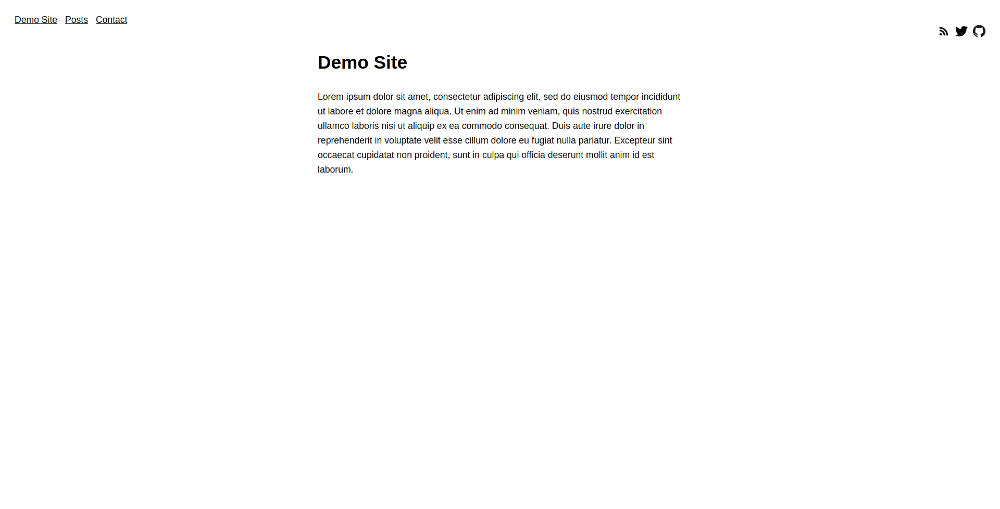
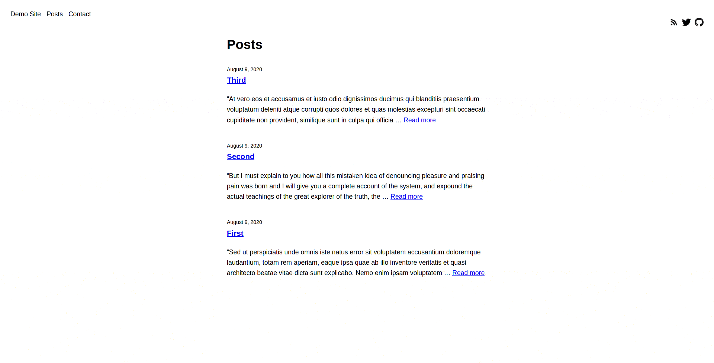

# Micro

Minimal hugo theme, with no javascript.

## Screenshots

Main view (single)


List view


## Example `config.toml`

```
baseURL = "http://example.com"
languageCode = "en-us"
title = "Demo Site"
theme = "micro"


[menu]

[[menu.main]]
  name = "Demo Site"
  url = "/"
  weight = 1

[[menu.main]]
  name = "Posts"
  url = "/posts"
  weight = 2

[[menu.main]]
  name = "Contact"
  url = "/contact"
  weight = 3


[params]

[[params.social]]
url = "https://github.com/yourname"
src = "/img/github.png"
alt = "GitHub"

[[params.social]]
url = "https://twitter.com/yourhandle"
src = "/img/twitter.svg"
alt = "Twitter"

[[params.social]]
url = "/index.xml"
src = "/img/rss.svg"
alt = "RSS"
```